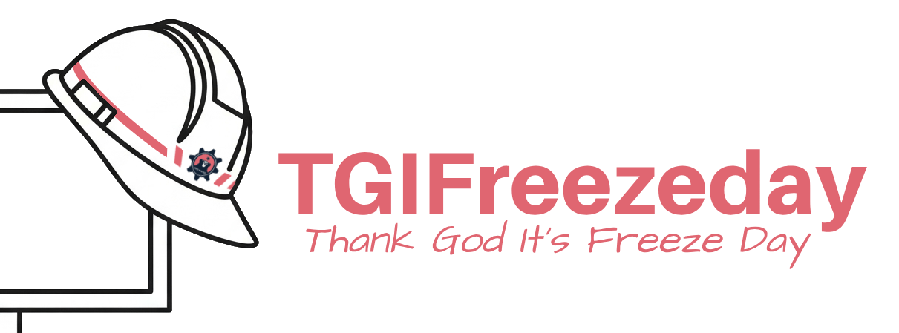
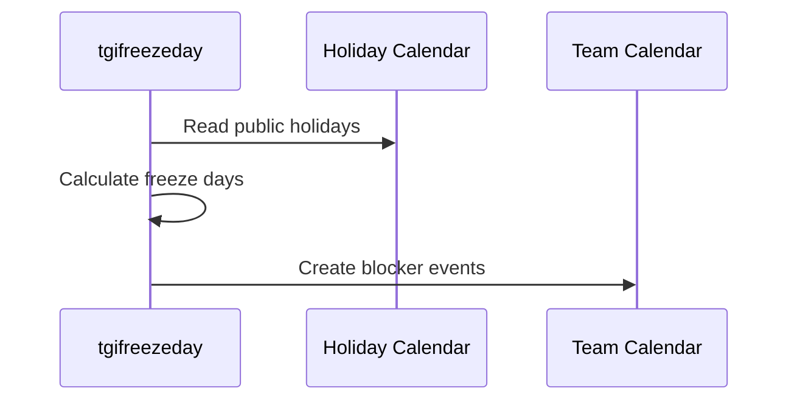

# TGI Freeze Day



A Go application that helps announce production freeze days to ensure safe deployments by:

1. Fetching holidays events from Google Calendar
2. Updating a specific calendar with freeze days information based on what you defined as a freeze-day

## Concepts

- **Freeze Day**: A day when production deployments are restricted to reduce risk
- **Blocker Event**: A calendar event (8AM-8PM) that signals "no deployments allowed" on the calendar. This serves as a notice for everyone.

## How It Works



1. **Reads** public holiday data from Google Calendar
2. **Calculates** which days are freeze days based on your rules  
3. **Creates** blocker events on your team calendar
4. **Manages** events automatically (add/remove as rules change)

## Commands

- `tgifreezeday sync` - Update calendar with current freeze day rules
- `tgifreezeday wipe-blockers` - Remove all managed events in time range
- `tgifreezeday list-blockers` - Show all managed events with details

## Configuration

### Basic Example

```yaml
shared:
  lookbackDays: 20      # Check 20 days back
  lookaheadDays: 60     # Check 60 days ahead
  
readFrom:
  googleCalendar:
    countryCode: "jpn"   # Japan public holidays
    todayIsFreezeDayIf:
      # - each key can be [yesterday, today, tomorrow]
      - today: [isTheFirstBusinessDayOfTheMonth]
      - today: [isTheLastBusinessDayOfTheMonth] 
      - tomorrow: [isNonBusinessDay]
      
writeTo:
  googleCalendar:
    id: "your-calendar-id@group.calendar.google.com"
    ifTodayIsFreezeDay:
      default:
        summary: "🚫 PRODUCTION FREEZE - No Deployments"
        description: |
          Production operations restricted today.<br>
          <a href="https://wiki.company.com/freeze-policy">Freeze Policy</a>
```

### Freeze Day Rules

Configure when freeze days occur using these conditions:

| Condition | Description |
|-----------|-------------|
| `isTheFirstBusinessDayOfTheMonth` | First weekday of month (excluding holidays) |
| `isTheLastBusinessDayOfTheMonth` | Last weekday of month (excluding holidays) |
| `isNonBusinessDay` | Weekend or public holiday |

### Freeze Rule Setting

The program strives to be as natural as possible. Here, in this snippet, you can kind of understand the intention:

```yaml
todayIsFreezeDayIf:
- today: [isTheFirstBusinessDayOfTheMonth]
```

> "Today is freeze-day if Today is the first business day of the month"

Here, `"today"` is a Relative Day Anchor. Here are the things you should know:
- Available Relative Day Anchor: `yesterday`, `today`, `tomorrow`
- Within an anchor, rules are AND together:
  - `today: [isA, isB]` meaning "today is freeze day if today is A and is B"
- Rules across anchors are `OR` together.
  - ```
    todayIsFreezeDayIf:
    - today: [isA, isB]
    - tomorrow: [isC]
    ```
  - Meaning, "today is freeze day if (today is A and B) OR (tomorrow is C)"

### Supported Countries

- `jpn` - Japan public holidays  
- `vnm` - Vietnam public holidays

### Rich Descriptions

HTML markup supported for calendar descriptions:

```yaml
description: |
  🚫 <strong>PRODUCTION FREEZE</strong><br><br>
  Restrictions:<br>
  <ul>
    <li>No deployments to production</li>
    <li>No infrastructure changes</li>
  </ul>
  Emergency: <a href="mailto:ops@company.com">ops@company.com</a>
```

**Supported tags**: `<br>`, `<ul><li>`, `<a href="">`, `<strong>`, `<em>`

**Note**: Avoid mixing newlines with `<br>` tags to prevent extra spacing.

## Setup

### Prerequisites

- Go 1.24+
- Google Calendar API access
- Service account with calendar permissions

### Installation

```bash
# Build from source
git clone https://github.com/nvat/tgifreezeday
cd tgifreezeday
make build

# Or use Docker
docker pull ghcr.io/nvat/tgifreezeday:latest
```

### Environment Variables

```bash
# Required
export GOOGLE_APP_CLIENT_CRED_JSON_PATH="/path/to/service-account.json"

# Optional
export CONFIG_PATH="config.yaml"           # Default: config.yaml  
export LOG_LEVEL="info"                    # debug, info, warn, error
export LOG_FORMAT="json"                   # json, text, colored
```

### Permissions Setup

1. **Enable** Google Calendar API in your Google Cloud project
2. **Create** service account with credentials JSON
3. **Share** your target calendar with the service account email
4. **Grant** "Make changes to events" permission

## Usage

```bash
# Sync freeze days to calendar
./bin/tgifreezeday sync

# Remove all managed events  
./bin/tgifreezeday wipe-blockers

# List current managed events
./bin/tgifreezeday list-blockers

# Development with colored logs
LOG_FORMAT=colored LOG_LEVEL=debug ./bin/tgifreezeday sync
```

### Docker Usage

```bash
docker run --rm \
  -e GOOGLE_APP_CLIENT_CRED_JSON_PATH=/app/creds.json \
  -v /path/to/creds.json:/app/creds.json \
  -v /path/to/config.yaml:/app/config.yaml \
  ghcr.io/nvat/tgifreezeday:latest sync
```

## Development

```bash
# Format and test
make test

# Build binary
make build

# Run with development logging
make sync    # Runs with colored debug logs
```

### Project Structure

```
cmd/tgifreezeday/          # CLI application
internal/
├── adapter/googlecalendar/  # Google Calendar API client
├── config/                  # Configuration management  
├── domain/                  # Business logic
└── helpers/                 # Utilities
```

### CI/CD

- **Lint & Test** on every push
- **Docker images** built on main branch
- **Multi-platform** support (linux/amd64, linux/arm64)
- **Images**: `ghcr.io/nvat/tgifreezeday:latest`

## License

MIT - Free to use, modify, and distribute with attribution.
