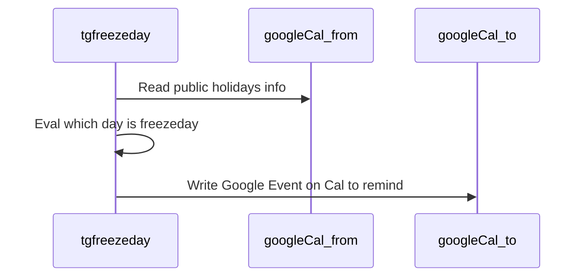

# TGI Freeze Day


A Go application that helps announce production freeze days to ensure safe deployments by:

1. Fetching holidays and special events from Google Calendar
2. Updating a specific calendar with freeze days information based on rules set by config.yaml

Here is a rough sequence diagram showing v1 feature:



## Features

### v1:

#### Core Functionality

For version 1, I am for these following features only:
- Reads from a source calendar, checking if today is a freeze day. Freeze day in v1 is defined as:
  - If today is the first business day of the month
  - If today is a non-business day (eg. holiday, weekends, etc.)
  - If tomorrow is a non-business day (eg. holiday, weekends, etc.)
- If today is a freeze day, on a destination calendar, do this "default" behavior:
  - Create a blocking (eg. "busy") event that spans from 8AM to 8PM that said "Today is Freeze-day."
  - The "default" option can be passed with a "summary" that override the default message above.

- "business day" is defined as day that normally business is being conducted.
- Google Calendar is the only Calendar supported

#### Non-core functionality

- In case of a rule change after first run, the program must be able to remove old events and add new events that reflects the rules set. Because of that, some design effort must go to how to identify events that are created by the tool.
- The program is designed to run periodically (eg. daily, weekly,...) so a "window" should be specify so it can update forward. For instance, window=7d meaning it will check the next 7 days for freeze days and mark the calendar, to avoid running for so long.
- Program must check for permission issue and fail-fast if no permission to read or write.
- Program must fail-fast if not set necessary environment variables
- Should use client library instead of calling API HTTP requests.

## Commands

The application supports the following commands:

- `tgifreezeday sync` - Full sync: wipe existing blockers and create new ones based on freeze day rules
- `tgifreezeday wipe-blockers` - Remove all existing blockers in the specified time range
- `tgifreezeday list-blockers` - List all existing blockers in the specified time range with full details

## Config Format:

The program will accept the following config to run.

```yaml
shared:
  lookbackDays: 20     # Days to look back from today (min: 20, max: 60)
  lookaheadDays: 60    # Days to look ahead from today (min: 20, max: 60)
readFrom:
  googleCalendar:
    countryCode: <supported country code> # "jpn", "vnm", A-3 ISO 3166 country code
    todayIsFreezeDayIf:
    - [yesterday, today, tomorrow]: # with this block, rules are AND together. To do OR, specify multiple items with same key.
      - isTheFirstBusinessDayOfTheMonth
      - isTheLastBusinessDayOfTheMonth
      - isNonBusinessDay
writeTo:
  googleCalendar:
    id: <google calendary id to read>
    ifTodayIsFreezeDay:
      default:
        summary: "string|null" # if `null`, use default message
        description: "string|null" # if `null`, use default message. Supports HTML markup for rich formatting.
```

#### Supported Countries:

- **jpn** - Japanese public holidays (filters out cultural observances like Tanabata)
- **vnm** - Vietnam public holidays

#### Example:

If your organization has the following rules:

> As a general rule, production operations should **not** be conducted on the following days:
> - **First business day of the month**
> - **Last business day of the month**
> - **The day before public holidays or non-work day**

The folloiwng config should reflect the above rule:

```yaml
shared:
  lookbackDays: 20
  lookaheadDays: 60
readFrom:
  googleCalendar:
    countryCode: "jpn"
    todayIsFreezeDayIf:
      - today:
        - isTheFirstBusinessDayOfTheMonth
      - today:
        - isTheLastBusinessDayOfTheMonth
      - tomorrow:
        - isNonBusinessDay
writeTo:
  googleCalendar:
    id: <google calendary id to read>
    ifTodayIsFreezeDay:
      default:
        summary: "Today is FREEZE-DAY. no PROD operation is allowed."
        description: |
          Production operations are restricted today.<br><br>For more information:<br><ul><li>See <a href="https://example.org/">freeze policy</a></li><li>Emergency contact: <a href="https://example.org/">example-team@example.org</a></li></ul>
```

### Description Field HTML Support

The `description` field supports HTML markup for rich formatting in Google Calendar:

**Supported HTML tags:**
- `<br>` - Line breaks
- `<ul><li>` - Bullet points
- `<a href="...">` - Links
- `<strong>` - Bold text
- `<em>` - Italic text

**Example with HTML formatting:**
```yaml
description: |
  🚫 <strong>PRODUCTION FREEZE ACTIVE</strong><br><br>
  
  What this means:<br>
  <ul>
    <li>No deployments to production</li>
    <li>No infrastructure changes</li>
    <li>Emergency changes require approval</li>
  </ul>
  
  Resources:<br>
  <ul>
    <li>Policy: <a href="https://bit.ly/freeze-policy">Freeze Policy</a></li>
    <li>Runbook: <a href="https://bit.ly/freeze-runbook">Emergency Runbook</a></li>
    <li>Contact: <a href="mailto:ops-team@company.com">ops-team@company.com</a></li>
  </ul>
```

Note that TGIFreezeday (v1) keeps whitespace in Description while sending, and Google Calendar doesn't trim them, so pairing newlines with `<br>` may create lots of unexpected newlines on the Google Calendar Event.

The above is only for illustration. In reality, you may want to strip all new lines in the description.

## License

MIT. Free to use, modify, distribute, but must retain source and attribution.
