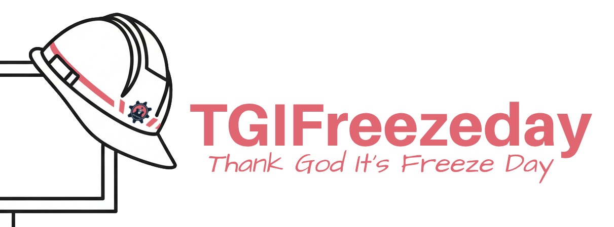
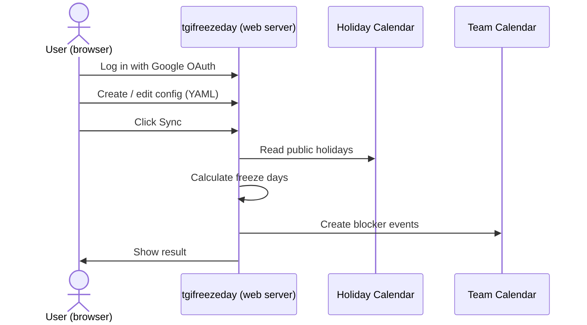

# TGI Freeze Day

🙏🧔🏽‍♀️👉🧊🗓️️ - Thank God It's Freeze Day

_no need to touch prod to day, touch grass instead_

[](https://github.com/nvat/tgifreezeday/actions/workflows/coverage.yml)

<!--  -->

A self-hosted web app that manages production freeze day blocker events on Google Calendar. Users log in with their Google account, define freeze-day rules in a YAML config, and the app creates blocker calendar events so the whole team knows when deployments are restricted.

## Concepts

- **Freeze Day**: A day when production deployments are restricted to reduce risk
- **Blocker Event**: A calendar event (8AM-8PM) that signals "no deployments allowed" on the calendar. This serves as a notice for everyone.

## How It Works


```mermaid
sequenceDiagram
    actor User as User (browser)
    participant App as tgifreezeday (web server)
    participant Source as Holiday Calendar
    participant Target as Team Calendar

    User->>App: Log in with Google OAuth
    User->>App: Create / edit config (YAML)
    User->>App: Click Sync
    App->>Source: Read public holidays
    App->>App: Calculate freeze days
    App->>Target: Create blocker events
    App->>User: Show result
```

1. **Log in** with your Google account via OAuth
2. **Create a config** — define your freeze-day rules and target calendar in YAML
3. **Sync** — the app reads public holidays, calculates freeze days, and writes blocker events to your team calendar
4. **Manage** — validate configs, wipe blockers, or list existing blocker events from the UI

## Web UI

The app is a web server. After starting it, open `http://localhost:8080` in your browser.

| Page | Description |
|------|-------------|
| Dashboard | Lists all configs with status and auto-sync schedule badges |
| Config Detail | View config YAML, run Sync / Wipe / Validate / List Blockers; configure Auto-Sync |
| Config Edit | Edit config name, YAML, and schema version |

## Configuration

Using the webapp, you can create Configs and edit them. Configs is the way you create Events on your Google Calendar based on your rules of "what is a freeze day".
Below show the configuration yaml example:

### Basic Example

```yaml
shared:
  lookbackDays: 20      # Check 20 days back
  lookaheadDays: 60     # Check 60 days ahead
  
readFrom:
  googleCalendar:
    # Basically this means check Japan public holidays calendar
    countryCode: "jpn"

    # This is a list, each entry is a key which can be [yesterday, today, tomorrow]
    # Each key contains a list of "conditions checks" which is AND within the key, and OR'd all keys
    # eg.
    # todayIsFreezeDayIf:
    #  - today: [isTheFirstBusinessDayOfTheMonth, isMonday]
    #  - today: [isTheLastBusinessDayOfTheMonth] 
    # Means Today is a FreezeDay if "today <Is The First Busines Day of The Month> AND <it is Monday>" OR "today <Is The Last Business Day Of the Month>"
    # Note: isMonday isn't available yet as of 2026 May 8th version
    todayIsFreezeDayIf:
      - today: [isTheFirstBusinessDayOfTheMonth]
      - today: [isTheLastBusinessDayOfTheMonth] 
      - tomorrow: [isNonBusinessDay]
      
writeTo:
  googleCalendar:
    # Calendar ID of the calendar to write blocker events to. The Webapp shall let you pick the calendar and fill the ID for you.
    id: "your-calendar-id@group.calendar.google.com"

    # what to do if today is Freeze day
    ifTodayIsFreezeDay:
      # Modifying the default blocker event: change summary, description, and time window.
      # Description supports html tags (this is Google Cal feature, we just reuse it, it may change though we don't guarantee support)
      default:
        summary: "🚫 PRODUCTION FREEZE - No Deployments"
        description: |
          Production operations restricted today.<br>
          <a href="https://wiki.company.com/freeze-policy">Freeze Policy</a>
        startTime: "08:00"  # optional, HH:MM format, default "08:00"
        endTime: "20:00"    # optional, HH:MM format, default "20:00"
```

### Freeze Day Rules

Configure when freeze days occur using these conditions:

| Condition | Description |
|-----------|-------------|
| `isTheFirstBusinessDayOfTheMonth` | First weekday of month (excluding holidays) |
| `isTheLastBusinessDayOfTheMonth` | Last weekday of month (excluding holidays) |
| `isNonBusinessDay` | Weekend or public holiday |

### Freeze Rule Setting

The program strives to be as natural as possible. Here, in this snippet, you can kind of understand the intention:

```yaml
todayIsFreezeDayIf:
- today: [isTheFirstBusinessDayOfTheMonth]
```

> "Today is freeze-day if Today is the first business day of the month"

Here, `"today"` is a Relative Day Anchor. Here are the things you should know:
- Available Relative Day Anchor: `yesterday`, `today`, `tomorrow`
- Within an anchor, rules are AND together:
  - `today: [isA, isB]` meaning "today is freeze day if today is A and is B"
- Rules across anchors are `OR` together.
  - ```
    todayIsFreezeDayIf:
    - today: [isA, isB]
    - tomorrow: [isC]
    ```
  - Meaning, "today is freeze day if (today is A and B) OR (tomorrow is C)"

### Supported Countries

- `jpn` - Japan public holidays  
- `vnm` - Vietnam public holidays

### Rich Descriptions

HTML markup supported for calendar descriptions:

```yaml
description: |
  🚫 <strong>PRODUCTION FREEZE</strong><br><br>
  Restrictions:<br>
  <ul>
    <li>No deployments to production</li>
    <li>No infrastructure changes</li>
  </ul>
  Emergency: <a href="mailto:ops@company.com">ops@company.com</a>
```

**Supported tags**: `<br>`, `<ul><li>`, `<a href="">`, `<strong>`, `<em>`

**Note**: Avoid mixing newlines with `<br>` tags to prevent extra spacing.

## Auto-Sync

Auto-Sync runs the sync automatically on a recurring schedule so you don't have to click **Sync** manually.

Configure it from the Config Detail page: click the **Auto Sync: off/weekly/monthly** label next to the config status. A modal lets you pick a schedule:

| Schedule | When it runs |
|----------|--------------|
| Off | Manual only — no automatic sync |
| Weekly | Every Monday at 09:00 JST |
| Monthly | 1st of each month at 09:00 JST |

> **Note:** When Auto-Sync is enabled, the manual **Sync** and **Wipe** buttons are disabled to prevent conflicts. Disable Auto-Sync first to use them again.

## Setup, Running, Contribute

Please check [CONTRIBUTE.md](./CONTRIBUTE.md) for prerequisites, environment variables, build instructions, Docker, and Kubernetes deployment.

## License

MIT - Free to use, modify, and distribute with attribution.
