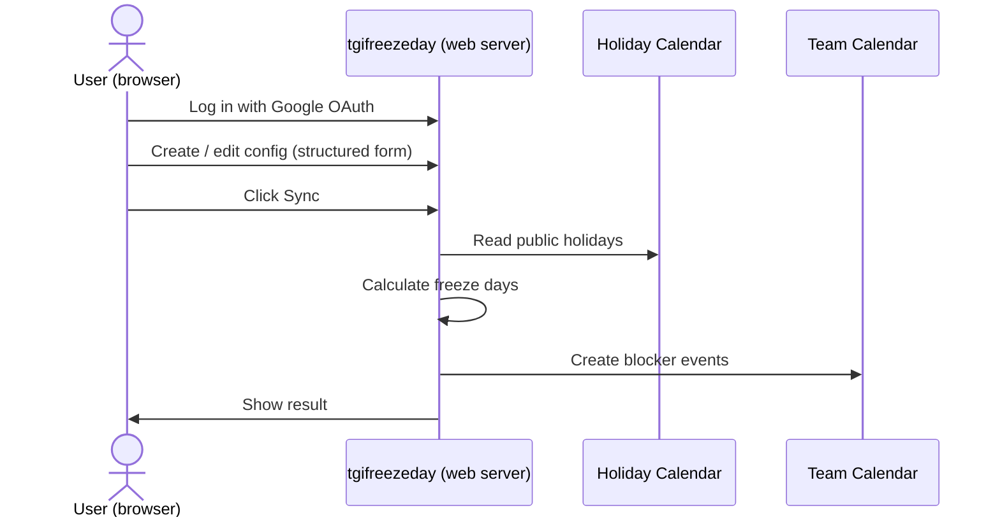

# TGI Freeze Day

🙏🧔🏽‍♀️👉🧊🗓️️ - Thank God It's Freeze Day

_no need to touch prod to day, touch grass instead_

[](https://github.com/nvat/tgifreezeday/actions/workflows/coverage.yml)

<!--  -->

A self-hosted web app that manages production freeze day blocker events on Google Calendar. Users log in with their Google account, define freeze-day rules through a structured form, and the app creates blocker calendar events so the whole team knows when deployments are restricted.

## Concepts

- **Freeze Day**: A day when production deployments are restricted to reduce risk
- **Blocker Event**: A calendar event (8AM-8PM) that signals "no deployments allowed" on the calendar. This serves as a notice for everyone.

## How It Works


```mermaid
sequenceDiagram
    actor User as User (browser)
    participant App as tgifreezeday (web server)
    participant Source as Holiday Calendar
    participant Target as Team Calendar

    User->>App: Log in with Google OAuth
    User->>App: Create / edit config (structured form)
    User->>App: Click Sync
    App->>Source: Read public holidays
    App->>App: Calculate freeze days
    App->>Target: Create blocker events
    App->>User: Show result
```

1. **Log in** with your Google account via OAuth
2. **Create a config** — fill in the structured form to define freeze-day rules and the target calendar
3. **Sync** — the app reads public holidays, calculates freeze days, and writes blocker events to your team calendar
4. **Manage** — validate configs, wipe blockers, or list existing blocker events from the UI

## Web UI

The app is a web server. After starting it, open `http://localhost:8080` in your browser.

| Page | Description |
|------|-------------|
| Dashboard | Lists all configs with status and auto-sync schedule badges |
| Config Detail | View config fields at a glance, run Sync / Wipe / Validate / List Blockers; configure Auto-Sync |
| Config Create / Edit | Fill in a structured form — no YAML required |

## Configuration

Configs define your freeze-day rules and target calendar. Create and edit them through the structured web form — no YAML needed.

> **Technical note:** YAML is the internal storage format. The form builds it server-side from your inputs.

<details>
<summary>YAML reference (internal storage format)</summary>

```yaml
shared:
  lookbackDays: 20      # Check 20 days back
  lookaheadDays: 60     # Check 60 days ahead

readFrom:
  googleCalendar:
    countryCode: "jpn"  # ISO 3166-1 alpha-3: "jpn" or "vnm"
    todayIsFreezeDayIf:
      - today: [isTheFirstBusinessDayOfTheMonth]
      - today: [isTheLastBusinessDayOfTheMonth]
      - tomorrow: [isNonBusinessDay]

writeTo:
  googleCalendar:
    id: "your-calendar-id@group.calendar.google.com"
    ifTodayIsFreezeDay:
      default:
        summary: "🚫 PRODUCTION FREEZE - No Deployments"
        description: |
          Production operations restricted today.<br>
          <a href="https://wiki.company.com/freeze-policy">Freeze Policy</a>
        startTime: "08:00"
        endTime: "20:00"
```

</details>

### Freeze Day Rules

Configure when freeze days occur using these conditions (available as dropdowns in the form):

| Condition | Description |
|-----------|-------------|
| `isTheFirstBusinessDayOfTheMonth` | First weekday of month (excluding holidays) |
| `isTheLastBusinessDayOfTheMonth` | Last weekday of month (excluding holidays) |
| `isNonBusinessDay` | Weekend or public holiday |

### Freeze Rule Setting

The form uses an OR/AND rule builder. Each **OR group** represents one row — if any group matches, today is a freeze day. Within a group, all conditions must match (AND).

Example form state that means "today is a freeze day if (today is the 1st business day) OR (today is the last business day) OR (tomorrow is a non-business day)":

- Group 1: `today` → 1st business day of month
- Group 2: `today` → last business day of month
- Group 3: `tomorrow` → non-business day

**Available anchors** (Relative Day):
- `today` — evaluates conditions against today
- `tomorrow` — evaluates conditions against tomorrow
- `next day` (nextDay) — evaluates conditions against the next calendar day

### Supported Countries

Available as a dropdown in the form:

- `jpn` — Japan public holidays
- `vnm` — Vietnam public holidays

### Rich Descriptions

HTML markup supported for calendar event descriptions (enter in the Description field):

```html
🚫 <strong>PRODUCTION FREEZE</strong><br><br>
Restrictions:<br>
<ul>
  <li>No deployments to production</li>
  <li>No infrastructure changes</li>
</ul>
Emergency: <a href="mailto:ops@company.com">ops@company.com</a>
```

**Supported tags**: `<br>`, `<ul><li>`, `<a href="">`, `<strong>`, `<em>`

**Note**: Avoid mixing newlines with `<br>` tags to prevent extra spacing.

## Auto-Sync

Auto-Sync runs the sync automatically on a recurring schedule so you don't have to click **Sync** manually.

Configure it from the Config Detail page: click the **Auto Sync: off/weekly/monthly** label next to the config status. A modal lets you pick a schedule:

| Schedule | When it runs |
|----------|--------------|
| Off | Manual only — no automatic sync |
| Weekly | Every Monday at 09:00 JST |
| Monthly | 1st of each month at 09:00 JST |

> **Note:** When Auto-Sync is enabled, the manual **Sync** and **Wipe** buttons are disabled to prevent conflicts. Disable Auto-Sync first to use them again.

## Setup, Running, Contribute

Please check [CONTRIBUTE.md](./CONTRIBUTE.md) for prerequisites, environment variables, build instructions, Docker, and Kubernetes deployment.

## License

MIT - Free to use, modify, and distribute with attribution.
